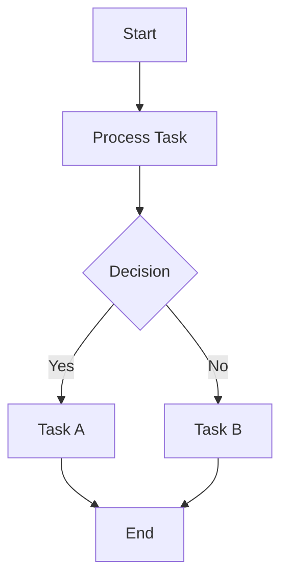
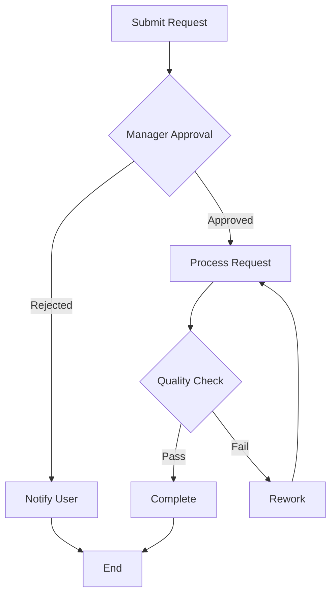
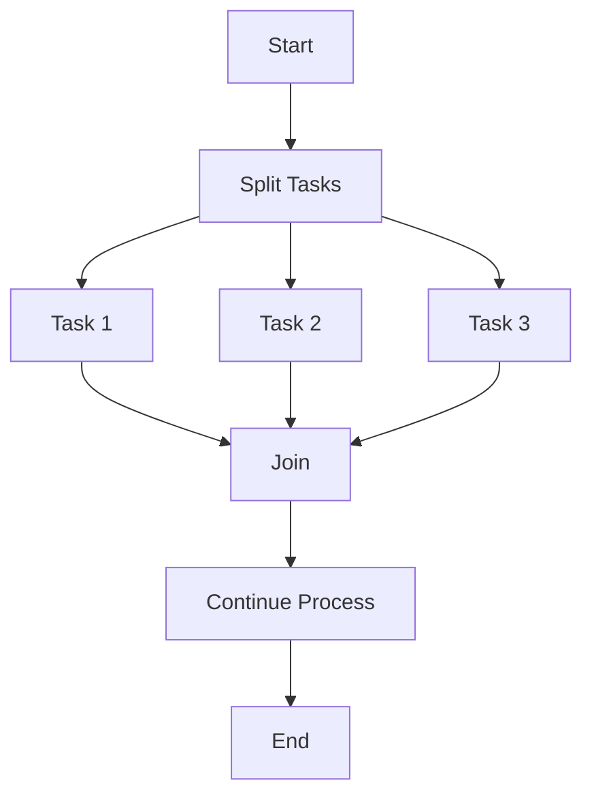

# Mermaid BPMN Diagram Creator

A simple, interactive web application for creating beautiful BPMN (Business Process Model and Notation) diagrams using Mermaid.js with copy-paste functionality.

## Features

- 🎨 **Live Preview** - See your BPMN diagram render in real-time
- 📋 **Copy-Paste Support** - Easily paste and edit Mermaid BPMN code
- 💾 **Export to SVG** - Download your diagrams as SVG files
- 📚 **Quick Examples** - Pre-built templates for common BPMN patterns
- 🎯 **Auto-Render** - Automatic diagram updates as you type
- 📱 **Responsive Design** - Works on desktop and mobile devices

## Usage

### Online

Open the `index.html` file in your web browser. No installation required!

### Local Usage

1. Clone this repository:
   ```bash
   git clone https://github.com/nicole1020/bpmn.git
   cd bpmn
   ```

2. Open `index.html` in your web browser:
   - **Windows**: Double-click `index.html`
   - **macOS**: `open index.html`
   - **Linux**: `xdg-open index.html`

### How to Create BPMN Diagrams

1. **Copy-Paste Method**:
   - Copy Mermaid BPMN code from anywhere
   - Paste it into the editor panel
   - The diagram will automatically render

2. **Use Examples**:
   - Click any example at the bottom of the page
   - It will load into the editor
   - Modify it to fit your needs

3. **Manual Creation**:
   - Type your Mermaid code directly in the editor
   - Use the Mermaid syntax for BPMN diagrams

## Mermaid BPMN Syntax Examples

### Simple Process Flow


### Approval Workflow


### Parallel Processing


## Button Functions

- **Render** - Manually render the diagram (auto-renders by default)
- **Copy Code** - Copy the Mermaid code to clipboard
- **Clear** - Clear the editor content
- **Download SVG** - Export the diagram as an SVG file

## Mermaid BPMN Elements

### Node Types
- `[Text]` - Rectangle (Task)
- `([Text])` - Rounded rectangle (Event)
- `{Text}` - Diamond (Gateway/Decision)
- `((Text))` - Circle
- `>Text]` - Asymmetric shape

### Flow Direction
- `graph TD` - Top to Bottom
- `graph LR` - Left to Right
- `graph BT` - Bottom to Top
- `graph RL` - Right to Left

### Connections
- `-->` - Arrow
- `---` - Line
- `-->|Label|` - Arrow with label
- `-.->` - Dotted arrow
- `==>` - Thick arrow

## Technologies Used

- **Mermaid.js** - Diagram rendering library
- **Pure HTML/CSS/JavaScript** - No build tools required
- **Modern CSS Grid** - Responsive layout

## License

MIT License - Feel free to use and modify!

## Contributing

Contributions are welcome! Please feel free to submit a Pull Request.