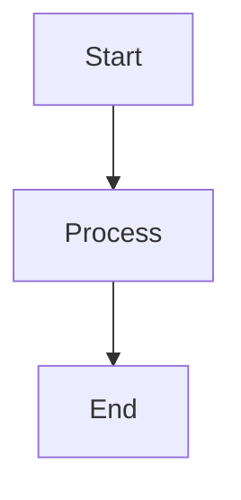
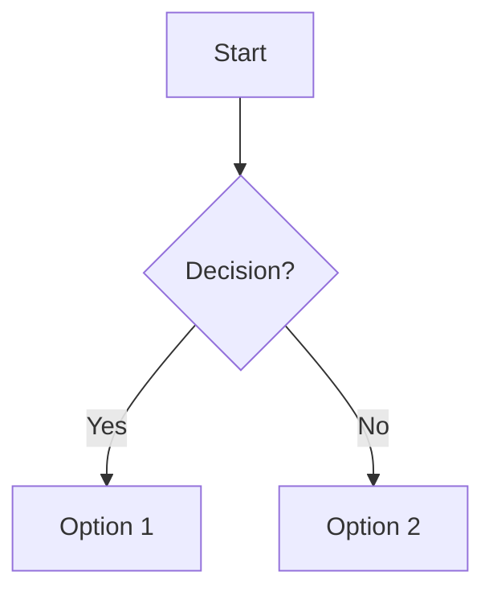
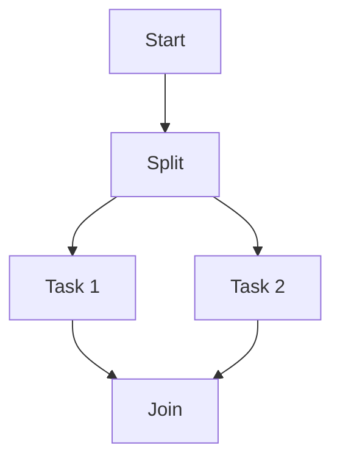
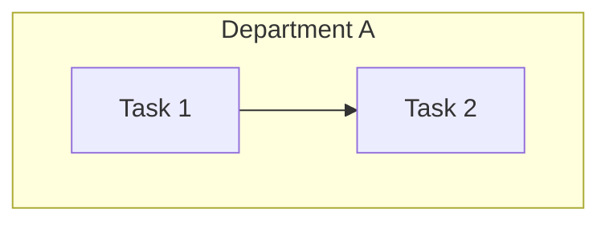
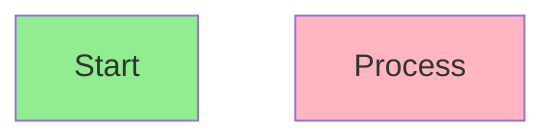

# Usage Guide - Mermaid BPMN Diagram Creator

## Quick Start

1. Open `index.html` in your web browser
2. Start creating diagrams immediately - no setup required!

## Copy-Paste Methods

### Method 1: Use Quick Examples
The easiest way to get started:

1. Scroll down to the "Quick Examples" section
2. Click on any example (Simple Process Flow, Approval Workflow, etc.)
3. The code will automatically load into the editor
4. The diagram will render in the preview panel
5. Edit the code to customize it for your needs

### Method 2: Copy from External Source
If you have Mermaid BPMN code from another source:

1. Copy the Mermaid code to your clipboard (Ctrl+C or Cmd+C)
2. Click in the Editor text area
3. Paste the code (Ctrl+V or Cmd+V)
4. The diagram will automatically render after 1 second

### Method 3: Type Manually
For creating diagrams from scratch:

1. Click in the Editor text area
2. Type your Mermaid BPMN code
3. The diagram will auto-render as you type (with 1-second delay)
4. Or click the "Render" button to manually update

## Button Functions

- **Clear** - Clears the editor content (with confirmation)
- **Copy Code** - Copies the current Mermaid code to your clipboard
- **Render** - Manually renders the diagram (useful if auto-render is slow)
- **Download SVG** - Exports the current diagram as an SVG file

## Example Workflow

Here's a typical workflow for creating a BPMN diagram:

1. **Start with a template**: Click "Order Processing" example
2. **Customize**: Edit node names, add/remove steps
3. **Preview**: Watch the diagram update automatically
4. **Export**: Click "Download SVG" to save your diagram
5. **Share**: Click "Copy Code" to share with colleagues

## Mermaid BPMN Syntax Quick Reference

### Basic Flow

### Decision Point

### Parallel Processing

### Subprocesses

## Tips for Best Results

1. **Use descriptive labels**: Make node labels clear and concise
2. **Keep it simple**: Break complex processes into multiple diagrams
3. **Test frequently**: Use the auto-render to catch syntax errors early
4. **Save your work**: Copy your code to a text file for backup
5. **Export early**: Download SVG versions of important diagrams

## Troubleshooting

**Diagram not rendering?**
- Check for syntax errors in your code
- Ensure you have an internet connection (for Mermaid library)
- Try clicking the "Render" button manually

**Code not loading from examples?**
- Refresh the page and try again
- Check browser console for JavaScript errors

**Can't download SVG?**
- Make sure the diagram has rendered successfully
- Check browser permissions for downloads

## Advanced Usage

### Custom Styling
You can customize node appearance using Mermaid's class syntax:

### Different Layouts
Change the flow direction:
- `graph TD` - Top to Down (default)
- `graph LR` - Left to Right
- `graph BT` - Bottom to Top
- `graph RL` - Right to Left

### Link Styles
- `-->` - Solid arrow
- `-.->` - Dotted arrow
- `==>` - Thick arrow
- `---` - Line without arrow

## Need Help?

For more information about Mermaid syntax, visit:
- [Mermaid Official Documentation](https://mermaid.js.org/)
- [Mermaid Live Editor](https://mermaid.live/)

Enjoy creating beautiful BPMN diagrams! 🎨
